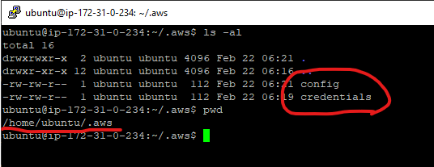

# zeply-btc-explorer

> `Code Challenge` project for **zeply.com**

```yml
node.js version: ^18.12.0
mongodb version: 6.0.4
yarn version: 1.22.4
```

Please refer to the `scripts` part of **./package.json** file:

```json
  ...
  "scripts": {
    "start": "node --max-old-space-size=4096 backend/server.js",
    "server": "nodemon --max-old-space-size=4096 backend/server.js",
    "client": "npm start --prefix frontend",
    "dev": "concurrently \"npm run server\" \"npm run client\"",
    "client:build": "npm run build --prefix frontend",
    "server:local": "npm run client:build && node --max-old-space-size=4096 backend/server.js",
    "server:aws_zeply_dev": "pm2 start ecosystem.config.js --node-args=\"--max-old-space-size=4096\"",
    "server:aws_zeply_prod": "npm run client:build && pm2 start ecosystem.config.js --node-args=\"--max-old-space-size=8192\""
  },
  ...
```

```bash
$ yarn install
# local
$ yarn run dev

# remote aws ec2
$ yarn run server:aws_zeply_dev
```

Visit

- http://localhost:5220/
- http://localhost:3000/

### Usage

#### Environment Variables

`*.env` files are as the followings:

```path
> ./environments/dev.env
> ./environments/prod.env
```

```yaml
NODE_ENV=development
## Ports
PORT=YOUR_PORT
PORT_REACT=YOUR_REACT_PORT
## MongoDB
MONGO_URI=YOUR_MONGO_URI
## Secrets / Keys
JWT_SECRET=YOUR_JWT_SECRET
BEARER_TOKEN_PREFIX=YOUR_BEARER_TOKEN_PREFIX
## AWS Server (*)
SERVER_IP=YOUR_SERVER_IP
SERVER_DOMAIN=YOUR_SERVER_DOMAIN
AWS_REGION=YOUR_AWS_REGION
## BlockChain
MY_WALLET_ADDR=YOUR_WALLET_ADDRESS
BC_API_KEY=YOUR_BC_API_KEY
```

#### Frontend (React) Config Variables

```path
frontend/src/configs/MyEnvConfig.js
```

`MyEnvConfig.js` file is as below:

```javascript | es6
export default {
  baseurl: {
    dev: 'YOUR_DEV_BASEURL',
    prod: 'YOUR_PROD_BASEURL'
  },
  bearer: {
    tokenPrefix: 'YOUR_BEARER_TOKEN_PREFIX'
  },
  aws: {
    region: 'YOUR_AWS_REGION',
    s3Bucket: 'YOUR_S3_BUCKET'
  }
};
```

#### AWS Credentials by Files

> This is necessary for **AWS JavaScript SDK** integration.

- **`~/.aws/credentials`**
  ```yaml
  [default]
  aws_access_key_id=YOUR_AWS_ACCESS_KEY_ID
  aws_secret_access_key=YOUR_AWS_SECRET_ACCESS_KEY
  ```
- **`~/.aws/config`**
  ```yaml
  [default]
  aws_access_key_id=YOUR_AWS_ACCESS_KEY_ID
  aws_secret_access_key=YOUR_AWS_SECRET_ACCESS_KEY
  ```

For details, please refer [here](https://docs.aws.amazon.com/AWSJavaScriptSDK/v3/latest/modules/_aws_sdk_credential_providers.html#sample-files).

For **Win 10**, the path would be the following:

```path
C:\Users\admin\.aws
```


For **Ubuntu 20.04** on AWS EC2, the path would be the following:

```path
/home/ubuntu/.aws
```



#### Install Dependencies

Backend & Frontend

```bash
$ yarn install

$ cd backend
$ yarn install

$ cd frontend
$ yarn install
```

---

&copy; 2023 Francisco Martinez

All Rights Reserved.
